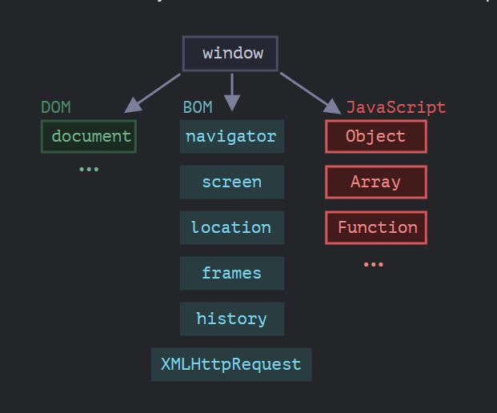

## Web-Browser 

---

# Document
Here we will learn to manipulate the a Web-page using JavaScript.

### 1. Browser environment, specs
The JS language was initially created for web-browsers. Since then it has evolved into a language with many uses and platforms.
A platform may be a browser, a web-server, some other host, or even a "Smart" coffee machine given it can run JS. Each of these proved platform-specific functionality. The JavaScript specification calls that a *host environment*.

A *host environment* provides its own objects and functions in addtion to the language core. Web browsers give a means to control Web pages. Node.js provides server-side features, and so on.

Here is a bird's eye view of what we have when JS runs in a Web-browser:

### 2. DOM tree
### 3. Walking the DOM
### 4. Searching: getElement*, querySelector*
### 5. Node properties: type, tag and contents
### 6. Attributes and properties
### 7. Modifying the document
### 8. Styles and classes
### 9. Element size and scrolling
### 10. Window sizes and scrolling
### 11. Coordinates
